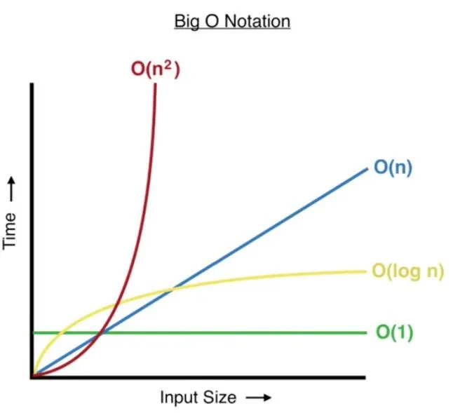

### **Complexity Analysis**

Complexity analysis is a critical concept in **Data Structures and Algorithms (DSA)**. It helps evaluate the efficiency of an algorithm in terms of **time** and **space**. This roadmap will guide you step-by-step through understanding and mastering complexity analysis.

---

### **1. Introduction to Complexity Analysis**
- **What is Complexity?**
  - Complexity measures the resource usage of an algorithm.
  - Two types: **Time Complexity** and **Space Complexity**.

- **Why Learn Complexity?**
  - To compare algorithms and choose the most efficient one for a given problem.
  - To optimize code for performance and scalability.

**Tasks:**
1. Learn the definitions of **time complexity** and **space complexity**.
2. Explore real-world examples where efficiency matters, e.g., searching large databases or processing big data.

---

### **2. Time Complexity**
- **What is Time Complexity?**
  - It quantifies the amount of time an algorithm takes to complete based on the size of its input.

- **Big-O Notation:**
  - Learn how to express time complexity using **Big-O** notation.
  - Examples of Big-O: 
    - \( O(1) \): Constant time.
    - \( O(\log n) \): Logarithmic time.
    - \( O(n) \): Linear time.
    - \( O(n^2) \): Quadratic time.

- **Common Algorithm Examples:**
  - **\( O(1) \):** Accessing an element in an array.
  - **\( O(\log n) \):** Binary search.
  - **\( O(n) \):** Linear search.
  - **\( O(n^2) \):** Nested loops.

**Tasks:**
1. Write simple programs to calculate time taken for different input sizes.
2. Compare algorithms with different complexities (e.g., linear search vs binary search).

---

### **3. Space Complexity**
- **What is Space Complexity?**
  - It measures the amount of memory an algorithm uses.
  - Includes space for:
    1. Input.
    2. Variables.
    3. Function calls.

- **Trade-offs Between Time and Space:**
  - Sometimes you trade memory for speed (or vice versa).

**Tasks:**
1. Analyze space usage of simple programs.
2. Study examples like recursion (where space grows with the depth of recursion).

---

### **4. Analyzing Code Complexity**
- Learn to calculate the time and space complexity of given code.
- Identify **dominant terms** in complex expressions to simplify Big-O.

**Example:**
```javascript
function example(arr) {
   let sum = 0;         // O(1)
   for (let i = 0; i < arr.length; i++) { // O(n)
       sum += arr[i];   // O(1) inside loop
   }
   return sum;          // O(1)
}
// Total Time Complexity: O(n)
```

**Tasks:**
1. Write small algorithms and analyze their complexity.
2. Practice reducing complex expressions like \( O(n + n^2) \) to \( O(n^2) \).

---

### **5. Best, Worst, and Average Case**
- Understand different cases:
  - **Best Case:** Minimum time (e.g., first element is the target in a search).
  - **Worst Case:** Maximum time (e.g., target is not in the array).
  - **Average Case:** Expected time over all possible inputs.

**Tasks:**
1. Identify best, worst, and average cases for sorting/searching algorithms.
2. Study examples like quicksort (worst case \( O(n^2) \), average case \( O(n \log n) \)).

---

### **6. Recursion and Complexity**
- Analyze time complexity in recursive algorithms using recurrence relations.
- Solve recurrence relations using the **Master Theorem**.

**Example:**
```javascript
function factorial(n) {
   if (n <= 1) return 1; // O(1)
   return n * factorial(n - 1); // Recursive call
}
// Time Complexity: O(n)
```

**Tasks:**
1. Write recursive algorithms (e.g., factorial, Fibonacci).
2. Calculate their time complexity.

---

### **7. Practice Problems**
- Solve problems on complexity analysis:
  - Compare linear search vs binary search.
  - Analyze sorting algorithms: Bubble Sort, Merge Sort, Quick Sort.
  - Write programs to calculate Fibonacci numbers iteratively and recursively, then compare their complexities.

**Resources:**
- [LeetCode](https://leetcode.com)
- [GeeksforGeeks](https://www.geeksforgeeks.org)
- [HackerRank](https://www.hackerrank.com)

---

### **8. Advanced Topics**
- **Amortized Time Complexity**:
  - Example: Dynamic array resizing.
- **Asymptotic Notations**:
  - Big-O, Big-\(\Omega\), Big-\(\Theta\).
- **Optimizations**:
  - Learn techniques to improve time/space efficiency.

---

### **Step 1: Introduction to Complexity Analysis**

---

#### **What is Complexity?**
Complexity refers to how much **time** or **space** an algorithm uses relative to the size of its input. It's crucial to measure the efficiency of algorithms to determine their feasibility for real-world problems.

- **Two Types of Complexity:**
  1. **Time Complexity**: Measures the amount of time an algorithm takes to execute.
  2. **Space Complexity**: Measures the amount of memory (RAM) an algorithm uses during execution.

**Example:**
```javascript
// Example: Adding numbers in an array
function sumArray(arr) {
    let sum = 0;               // Takes constant space (O(1))
    for (let i = 0; i < arr.length; i++) { // Iterates n times (O(n))
        sum += arr[i];         // Adds each element
    }
    return sum;                // Time complexity: O(n)
}
```

In this example:
- **Time Complexity** depends on the length of the array (`n`).
- **Space Complexity** is constant because the algorithm doesn’t use extra memory relative to the input size.

---

#### **Why Learn Complexity?**

1. **Compare Algorithms:**
   When solving a problem, you often have multiple ways (algorithms) to implement a solution. Complexity analysis helps you choose the **most efficient** one.

   **Example:**
   - Linear search: \( O(n) \) for an unsorted list.
   - Binary search: \( O(\log n) \) for a sorted list.
   Binary search is faster for larger datasets, but it requires sorting beforehand.

2. **Optimize Performance:**
   Understanding complexity helps identify bottlenecks and allows optimization of both:
   - **Time efficiency**: Faster code execution.
   - **Space efficiency**: Lower memory usage.

   **Example:**
   - A social media app might optimize feed loading for faster user experience.

3. **Scalability:**
   A scalable algorithm can handle larger inputs efficiently. An algorithm with \( O(n^2) \) time complexity might be acceptable for small datasets but unusable for large ones.

---

### **Tasks for Step 1**

1. **Hands-On Practice:**
   Write a simple algorithm (e.g., find the maximum value in an array) and identify its time and space complexity.

   **Example:**
   ```javascript
   function findMax(arr) {
       let max = arr[0];          // O(1) space
       for (let i = 1; i < arr.length; i++) { // O(n) time
           if (arr[i] > max) {
               max = arr[i];
           }
       }
       return max;                // O(1) space
   }
   ```

2. **Think Real-World:**
   Identify real-world applications where algorithm efficiency is crucial, like:
   - Sorting customer records for fast retrieval.
   - Searching in large datasets (e.g., Google Search).

---


### **Step 2: Time Complexity in Depth**

---

#### **What is Time Complexity?**
Time complexity measures how the runtime of an algorithm changes as the size of the input (\( n \)) increases. It helps us predict the performance of the algorithm for larger inputs.

---

#### **Big-O Notation**
Big-O notation is a mathematical way to describe the **upper bound** of an algorithm's time complexity. It focuses on the **dominant term** and ignores constants or less significant terms.

**Common Big-O Complexities:**

| Complexity        | Description                        | Example                         |
|--------------------|------------------------------------|---------------------------------|
| **O(1)**          | **Constant Time**: Independent of input size. | Accessing an array element.   |
| **O(\( \log n \))** | **Logarithmic Time**: Halves the problem size at each step. | Binary search.                |
| **O(n)**          | **Linear Time**: Grows proportionally with input size. | Iterating through an array.   |
| **O(\( n^2 \))**   | **Quadratic Time**: Grows quadratically with input size. | Nested loops over the input.  |
| **O(\( 2^n \))**   | **Exponential Time**: Doubles the runtime for every increase in input size. | Solving subsets (e.g., recursion). |

---

#### **Common Algorithm Examples**
Here are some examples to understand each type of time complexity:

1. **O(1): Constant Time**
   ```javascript
   function getFirstElement(arr) {
       return arr[0]; // Always takes the same time, regardless of array size.
   }
   ```
   - Accessing an element in an array or performing a simple operation is \( O(1) \).

2. **O(\( \log n \)): Logarithmic Time**
   ```javascript
   function binarySearch(arr, target) {
       let low = 0, high = arr.length - 1;
       while (low <= high) {
           let mid = Math.floor((low + high) / 2);
           if (arr[mid] === target) return mid;
           if (arr[mid] < target) low = mid + 1;
           else high = mid - 1;
       }
       return -1; // Target not found
   }
   ```
   - In binary search, the input size is halved at each step, leading to \( O(\log n) \).

3. **O(n): Linear Time**
   ```javascript
   function linearSearch(arr, target) {
       for (let i = 0; i < arr.length; i++) {
           if (arr[i] === target) return i;
       }
       return -1;
   }
   ```
   - Linear search involves checking each element, so runtime grows linearly with input size.

4. **O(\( n^2 \)): Quadratic Time**
   ```javascript
   function bubbleSort(arr) {
       for (let i = 0; i < arr.length; i++) {
           for (let j = 0; j < arr.length - i - 1; j++) {
               if (arr[j] > arr[j + 1]) {
                   let temp = arr[j];
                   arr[j] = arr[j + 1];
                   arr[j + 1] = temp;
               }
           }
       }
       return arr;
   }
   ```
   - Nested loops lead to quadratic time complexity, as each loop iterates over the input size.

---

#### **How to Analyze Time Complexity**
1. **Count Operations:**
   - Count the number of iterations or significant operations in your code.
   
2. **Identify Dominant Terms:**
   - Focus on the fastest-growing term as \( n \) increases, ignoring constants.

   **Example:**
   ```javascript
   function example(arr) {
       let sum = 0;               // O(1)
       for (let i = 0; i < arr.length; i++) { // O(n)
           sum += arr[i];
       }
       for (let j = 0; j < arr.length; j++) { // O(n)
           console.log(arr[j]);
       }
       return sum;                // O(1)
   }
   ```
   - Total Time Complexity = \( O(1) + O(n) + O(n) + O(1) = O(n) \).

3. **Nested Loops:**
   - Multiply the complexities of nested loops.
   
   **Example:**
   ```javascript
   for (let i = 0; i < n; i++) { // O(n)
       for (let j = 0; j < n; j++) { // O(n)
           console.log(i, j);   // O(1)
       }
   }
   ```
   - Time Complexity: \( O(n \times n) = O(n^2) \).

---

#### **Tasks for Step 2**
1. **Practice Writing Big-O Notations:**
   - Write simple algorithms and determine their time complexity.
   - Example: Find the minimum value in an array.

2. **Analyze Common Algorithms:**
   - Linear Search (\( O(n) \)).
   - Binary Search (\( O(\log n) \)).
   - Bubble Sort (\( O(n^2) \)).

3. **Real-World Comparison:**
   - Compare \( O(\log n) \), \( O(n) \), and \( O(n^2) \) for large datasets. Try running code for arrays of different sizes and measure execution time.

---

### **Step 3: Space Complexity**

---

#### **What is Space Complexity?**

Space Complexity measures the amount of **memory** an algorithm uses during execution, including:
1. **Input Space**: Memory required for the input data.
2. **Auxiliary Space**: Extra space needed for variables, temporary data, or structures.
3. **Call Stack Space**: Memory consumed by recursive calls or function calls.

---

#### **Why Is Space Complexity Important?**
1. **Resource Constraints**: Devices with limited memory need efficient algorithms to avoid crashes or slowdowns.
2. **Trade-offs with Time**: Sometimes, an algorithm uses more space to save time or vice versa (e.g., caching results).

---

#### **Components of Space Complexity**
1. **Fixed Part**:
   - Memory required by constants, variables, and compiled code.
   - Example: Declaring variables like integers or floats.
   
2. **Variable Part**:
   - Memory depends on the size of the input.
   - Example: Arrays, linked lists, or recursive function calls.

---

#### **Space Complexity of Common Algorithms**
Here are some examples with analysis:

1. **Iterative Function (Constant Space)**:
   ```javascript
   function sumArray(arr) {
       let sum = 0; // O(1) space
       for (let i = 0; i < arr.length; i++) {
           sum += arr[i];
       }
       return sum;
   }
   ```
   - Space Complexity: \( O(1) \), as no extra memory grows with input size.

2. **Recursive Function (Linear Space)**:
   ```javascript
   function factorial(n) {
       if (n === 0) return 1;
       return n * factorial(n - 1);
   }
   ```
   - **Recursive Call Stack**: Each function call uses memory.
   - Space Complexity: \( O(n) \), where \( n \) is the recursion depth.

3. **Sorting Algorithm (Auxiliary Space)**:
   - **Merge Sort**:
     - Requires temporary arrays during merging.
     - Space Complexity: \( O(n) \).
   - **Quick Sort**:
     - Uses the call stack for recursive calls.
     - Space Complexity: \( O(\log n) \) for balanced partitions, \( O(n) \) for worst case.

---

#### **Trade-Offs Between Time and Space**
- Some algorithms save **time** by using **more memory**.
- Example: **Dynamic Programming** (like Fibonacci with memoization):
   ```javascript
   function fibonacci(n, memo = {}) {
       if (n <= 1) return n;
       if (n in memo) return memo[n];
       memo[n] = fibonacci(n - 1, memo) + fibonacci(n - 2, memo);
       return memo[n];
   }
   ```
   - **Space Complexity**: \( O(n) \) for storing results.
   - **Time Complexity**: Reduced to \( O(n) \) from \( O(2^n) \).

---

#### **Tasks for Space Complexity**

1. **Analyze Space Usage in Programs**:
   - Write a program to reverse an array iteratively and recursively. Compare the space usage.

   **Example: Iterative Array Reversal**:
   ```javascript
   function reverseArray(arr) {
       let left = 0, right = arr.length - 1;
       while (left < right) {
           [arr[left], arr[right]] = [arr[right], arr[left]];
           left++;
           right--;
       }
       return arr;
   }
   ```
   - Space Complexity: \( O(1) \).

   **Recursive Array Reversal**:
   ```javascript
   function reverseArrayRec(arr, left = 0, right = arr.length - 1) {
       if (left >= right) return arr;
       [arr[left], arr[right]] = [arr[right], arr[left]];
       return reverseArrayRec(arr, left + 1, right - 1);
   }
   ```
   - Space Complexity: \( O(n) \) due to recursive calls.

2. **Study Recursion**:
   - Write recursive functions and track how stack size changes with input.
   - Example: Implement a recursive Fibonacci sequence and analyze the memory used.

3. **Real-World Case**:
   - Study memory usage in sorting algorithms like Merge Sort (with auxiliary arrays) vs. Quick Sort (with stack space).

---


### **4. Analyzing Code Complexity**

---

#### **Steps to Analyze Code Complexity**
To analyze the **time complexity** and **space complexity** of a piece of code:

1. **Understand the Code:**
   - Identify loops, function calls, and operations.
   - Note how the size of the input (\( n \)) affects these components.

2. **Break It Down:**
   - Calculate the complexity for each block of code (loops, conditionals, function calls, etc.).
   - Add or multiply complexities depending on whether they're sequential or nested.

3. **Combine and Simplify:**
   - Combine the complexities of different parts.
   - Keep only the **dominant term** and ignore constants or less significant terms.

---

#### **Example 1: Iterative Sum**

```javascript
function example(arr) {
    let sum = 0;                   // O(1)
    for (let i = 0; i < arr.length; i++) { // O(n)
        sum += arr[i];             // O(1) (inside loop)
    }
    return sum;                    // O(1)
}
```

**Step-by-Step Analysis:**
- **Line 2:** Declaring a variable is \( O(1) \).
- **Line 3:** A loop runs \( n \) times (\( n \) is the array size), so it's \( O(n) \).
- **Line 4:** Each iteration has a constant time operation (\( O(1) \)).
- **Line 5:** Returning the value is \( O(1) \).

**Total Time Complexity:**
- \( O(1) + O(n \cdot 1) + O(1) = O(n) \).

---

#### **Example 2: Nested Loops**

```javascript
function printPairs(arr) {
    for (let i = 0; i < arr.length; i++) {        // O(n)
        for (let j = 0; j < arr.length; j++) {    // O(n)
            console.log(arr[i], arr[j]);         // O(1)
        }
    }
}
```

**Step-by-Step Analysis:**
- The outer loop runs \( n \) times (\( O(n) \)).
- For each iteration of the outer loop, the inner loop runs \( n \) times (\( O(n) \)).
- Printing a pair (\( O(1) \)) happens \( n \times n \) times.

**Total Time Complexity:**
- \( O(n) \cdot O(n) = O(n^2) \).

---

#### **Example 3: Reducing Complex Expressions**

```javascript
function example(arr) {
    for (let i = 0; i < arr.length; i++) { // O(n)
        console.log(arr[i]);               // O(1)
    }
    for (let i = 0; i < arr.length; i++) { // O(n)
        for (let j = 0; j < arr.length; j++) { // O(n)
            console.log(arr[i], arr[j]);   // O(1)
        }
    }
}
```

**Step-by-Step Analysis:**
1. **First Loop:** Runs \( n \) times, so \( O(n) \).
2. **Nested Loop:** Outer loop runs \( n \), and inner loop runs \( n \), giving \( O(n^2) \).

**Total Time Complexity:**
- \( O(n) + O(n^2) \).
- Dominant Term: \( O(n^2) \) (since \( n^2 > n \) as \( n \) grows).

**Simplified Complexity:**
- \( O(n^2) \).

---

#### **Tasks**
1. **Write and Analyze Small Algorithms:**
   - Implement algorithms like finding the maximum element, reversing an array, or binary search.
   - Analyze their time and space complexities.

2. **Reduce Complex Expressions:**
   - Simplify \( O(n + n^2) \) to \( O(n^2) \).
   - Simplify \( O(n + \log n) \) to \( O(n) \).

3. **Nested Loops Practice:**
   - Create examples with two or more nested loops.
   - Analyze their complexities step by step.

---

### **5. Best, Worst, and Average Case Analysis**

When analyzing an algorithm, it's crucial to consider how it performs under different conditions, such as when the input is optimal or difficult to handle. These scenarios are captured as **Best Case**, **Worst Case**, and **Average Case**.

---

### **1. Best Case**
- **Definition:** The minimum time the algorithm takes to complete, given the most favorable input.
- **Example: Linear Search**  
  If the target element is the first element in the array:
  ```javascript
  function linearSearch(arr, target) {
      for (let i = 0; i < arr.length; i++) {
          if (arr[i] === target) return i; // Found at the first position.
      }
      return -1;
  }
  ```
  - Best Case: \( O(1) \) (target is the first element).

---

### **2. Worst Case**
- **Definition:** The maximum time the algorithm takes to complete, given the least favorable input.
- **Example: Linear Search**  
  If the target element is not in the array:
  ```javascript
  function linearSearch(arr, target) {
      for (let i = 0; i < arr.length; i++) {
          if (arr[i] === target) return i; // Never found.
      }
      return -1; // Loops through all elements.
  }
  ```
  - Worst Case: \( O(n) \) (iterates through the entire array).

---

### **3. Average Case**
- **Definition:** The expected time for the algorithm over all possible inputs.
- Calculated as a weighted average of all possible scenarios.

**Example: Quick Sort**
- **Best Case:** \( O(n \log n) \)  
  The pivot always splits the array into two equal halves.
- **Worst Case:** \( O(n^2) \)  
  The pivot always splits the array into two parts with sizes \( n-1 \) and \( 0 \).  
  Example: Sorting an already sorted array with the first element as the pivot.
- **Average Case:** \( O(n \log n) \)  
  Happens when the pivot generally divides the array into two reasonably balanced parts.

---

### **Tasks**

1. **Identify Best, Worst, and Average Cases for Algorithms**
   - Example: Binary Search:
     - Best Case: \( O(1) \) (target is the middle element).
     - Worst Case: \( O(\log n) \) (target is not present or near the ends of the search space).
     - Average Case: \( O(\log n) \).

2. **Practice Analyzing Cases**
   - For sorting algorithms:
     - **Bubble Sort**:
       - Best Case: \( O(n) \) (array is already sorted).
       - Worst Case: \( O(n^2) \) (array is in reverse order).
       - Average Case: \( O(n^2) \).
     - **Merge Sort**:
       - Best/Worst/Average Case: \( O(n \log n) \) (same for all inputs).

3. **Compare Sorting Algorithms**  
   Study the time complexity of different sorting algorithms:
   - Quick Sort, Merge Sort, Insertion Sort, and Selection Sort.

---

### **6. Recursion and Complexity**

---

#### **What is Recursion?**
Recursion is a technique where a function calls itself to solve a problem. Every recursive function needs:
1. **Base Case:** A condition that stops the recursion.
2. **Recursive Step:** The part where the function calls itself with a smaller problem.

---

### **Analyzing Time Complexity in Recursive Algorithms**

To analyze the time complexity:
1. Identify the **recurrence relation** (a mathematical way to express the time complexity of a recursive function).
2. Solve the recurrence relation using:
   - Substitution method.
   - **Master Theorem** (if applicable).

---

### **Example 1: Factorial**

```javascript
function factorial(n) {
    if (n <= 1) return 1; // Base Case: O(1)
    return n * factorial(n - 1); // Recursive Call
}
```

**Steps to Analyze:**
1. The function makes \( n \) recursive calls.
2. Each call performs \( O(1) \) work for the multiplication.

**Recurrence Relation:**  
\( T(n) = T(n - 1) + O(1) \)

**Solution:**  
Unroll the recursion:
- \( T(n) = T(n - 1) + O(1) \)
- \( T(n - 1) = T(n - 2) + O(1) \)
- \( T(n) = O(1) + O(1) + \dots + O(1) \) (repeated \( n \) times).

**Time Complexity:**  
\( O(n) \).

---

### **Example 2: Fibonacci**

```javascript
function fibonacci(n) {
    if (n <= 1) return n; // Base Case: O(1)
    return fibonacci(n - 1) + fibonacci(n - 2); // Recursive Calls
}
```

**Steps to Analyze:**
1. Each call makes two recursive calls, leading to an exponential growth in the number of calls.
2. The depth of the recursion tree is \( n \).

**Recurrence Relation:**  
\( T(n) = T(n - 1) + T(n - 2) + O(1) \)

**Solution:**  
This solves to \( O(2^n) \) because the recursion tree has \( 2^n \) nodes at its deepest level.

---

### **Master Theorem for Recurrences**

The **Master Theorem** provides an easy way to solve recurrence relations of the form:

\[
T(n) = aT\left(\frac{n}{b}\right) + O(n^d)
\]

Where:
- \( a \): Number of recursive calls.
- \( b \): Division factor of the problem size.
- \( d \): Exponent of the work outside the recursion.

**Cases:**
1. If \( \log_b(a) < d \), Time Complexity is \( O(n^d) \).
2. If \( \log_b(a) = d \), Time Complexity is \( O(n^d \log n) \).
3. If \( \log_b(a) > d \), Time Complexity is \( O(n^{\log_b(a)}) \).

---

### **Example 3: Merge Sort**

```javascript
function mergeSort(arr) {
    if (arr.length <= 1) return arr; // Base Case: O(1)
    let mid = Math.floor(arr.length / 2);
    let left = mergeSort(arr.slice(0, mid)); // Recursive Call
    let right = mergeSort(arr.slice(mid));  // Recursive Call
    return merge(left, right);              // Merging: O(n)
}
```

**Steps to Analyze:**
1. Each recursive step divides the array into two halves.
2. Merging two halves takes \( O(n) \).

**Recurrence Relation:**  
\( T(n) = 2T(n/2) + O(n) \)

**Apply Master Theorem:**  
- \( a = 2 \), \( b = 2 \), \( d = 1 \)
- \( \log_b(a) = \log_2(2) = 1 \)
- \( \log_b(a) = d \).

**Result:**  
Time Complexity: \( O(n \log n) \).

---

### **Tasks**

1. **Write Recursive Functions:**
   - Factorial.
   - Fibonacci.
   - Merge Sort.

2. **Calculate Time Complexity:**
   - Use recurrence relations for each function.
   - Solve using the Master Theorem if applicable.

3. **Practice Common Recursion Patterns:**
   - Divide-and-Conquer algorithms (e.g., Quick Sort, Merge Sort).
   - Backtracking (e.g., solving mazes, N-Queens problem).

---

### **7. Practice Problems: Complexity Analysis**

Here are practice problems and exercises designed to solidify your understanding of complexity analysis.

---

### **1. Compare Linear Search vs Binary Search**

**Problem:**
1. Write a program to implement **Linear Search** and **Binary Search**.
2. Compare their time complexities with varying input sizes.

**Instructions:**
- Generate an array of random integers.
- Use `console.time()` and `console.timeEnd()` in JavaScript to measure execution times.

**Expected Complexity:**
- Linear Search: \( O(n) \)
- Binary Search: \( O(\log n) \)

**Code Skeleton:**

```javascript
function linearSearch(arr, target) {
    for (let i = 0; i < arr.length; i++) {
        if (arr[i] === target) return i;
    }
    return -1;
}

function binarySearch(arr, target) {
    let left = 0, right = arr.length - 1;
    while (left <= right) {
        const mid = Math.floor((left + right) / 2);
        if (arr[mid] === target) return mid;
        else if (arr[mid] < target) left = mid + 1;
        else right = mid - 1;
    }
    return -1;
}

// Test cases
const arr = Array.from({ length: 1000000 }, (_, i) => i); // Large sorted array
const target = 999999;

console.time("Linear Search");
console.log(linearSearch(arr, target));
console.timeEnd("Linear Search");

console.time("Binary Search");
console.log(binarySearch(arr, target));
console.timeEnd("Binary Search");
```

---

### **2. Analyze Sorting Algorithms**

**Problem:**
- Implement and analyze:
  - Bubble Sort
  - Merge Sort
  - Quick Sort

**Steps:**
1. Implement the algorithms.
2. Measure execution time for small and large arrays.
3. Compare their time complexities.

**Expected Complexity:**
- Bubble Sort: \( O(n^2) \)
- Merge Sort: \( O(n \log n) \)
- Quick Sort: \( O(n \log n) \) (best/average case), \( O(n^2) \) (worst case).

**Code Skeleton:**

```javascript
function bubbleSort(arr) {
    let n = arr.length;
    for (let i = 0; i < n - 1; i++) {
        for (let j = 0; j < n - i - 1; j++) {
            if (arr[j] > arr[j + 1]) [arr[j], arr[j + 1]] = [arr[j + 1], arr[j]];
        }
    }
    return arr;
}

function mergeSort(arr) {
    if (arr.length <= 1) return arr;
    const mid = Math.floor(arr.length / 2);
    const left = mergeSort(arr.slice(0, mid));
    const right = mergeSort(arr.slice(mid));
    return merge(left, right);
}

function merge(left, right) {
    let sorted = [], i = 0, j = 0;
    while (i < left.length && j < right.length) {
        if (left[i] < right[j]) sorted.push(left[i++]);
        else sorted.push(right[j++]);
    }
    return [...sorted, ...left.slice(i), ...right.slice(j)];
}

function quickSort(arr) {
    if (arr.length <= 1) return arr;
    const pivot = arr[arr.length - 1];
    const left = arr.filter((x) => x < pivot);
    const right = arr.filter((x) => x > pivot);
    return [...quickSort(left), pivot, ...quickSort(right)];
}

// Test
const arr = Array.from({ length: 10000 }, () => Math.floor(Math.random() * 10000));

console.time("Bubble Sort");
bubbleSort([...arr]);
console.timeEnd("Bubble Sort");

console.time("Merge Sort");
mergeSort([...arr]);
console.timeEnd("Merge Sort");

console.time("Quick Sort");
quickSort([...arr]);
console.timeEnd("Quick Sort");
```

---

### **3. Fibonacci Numbers: Iterative vs Recursive**

**Problem:**
1. Write a program to calculate Fibonacci numbers both iteratively and recursively.
2. Compare their time complexities.

**Expected Complexity:**
- Iterative: \( O(n) \)
- Recursive: \( O(2^n) \) (naive), \( O(n) \) (with memoization).

**Code Skeleton:**

```javascript
// Recursive
function fibonacciRecursive(n) {
    if (n <= 1) return n;
    return fibonacciRecursive(n - 1) + fibonacciRecursive(n - 2);
}

// Recursive with Memoization
function fibonacciMemo(n, memo = {}) {
    if (n in memo) return memo[n];
    if (n <= 1) return n;
    memo[n] = fibonacciMemo(n - 1, memo) + fibonacciMemo(n - 2, memo);
    return memo[n];
}

// Iterative
function fibonacciIterative(n) {
    if (n <= 1) return n;
    let a = 0, b = 1;
    for (let i = 2; i <= n; i++) {
        [a, b] = [b, a + b];
    }
    return b;
}

// Test
const n = 40;

console.time("Fibonacci Recursive");
console.log(fibonacciRecursive(n));
console.timeEnd("Fibonacci Recursive");

console.time("Fibonacci Memoized");
console.log(fibonacciMemo(n));
console.timeEnd("Fibonacci Memoized");

console.time("Fibonacci Iterative");
console.log(fibonacciIterative(n));
console.timeEnd("Fibonacci Iterative");
```

---

### **Resources**

1. **Platforms for Practice:**
   - [LeetCode](https://leetcode.com): Complexity analysis and sorting challenges.
   - [GeeksforGeeks](https://www.geeksforgeeks.org): Algorithm tutorials with examples.
   - [HackerRank](https://www.hackerrank.com): Practice recursive and sorting algorithms.

2. **Books:**
   - *Introduction to Algorithms* by Cormen et al.
   - *Cracking the Coding Interview* by Gayle Laakmann McDowell.

---


### **8. Advanced Topics: Complexity Analysis**

---

#### **1. Amortized Time Complexity**

Amortized complexity averages the cost of operations over a sequence, making occasional expensive operations more acceptable.

##### **Example: Dynamic Array Resizing**
Dynamic arrays double their size when full. While resizing takes \( O(n) \) for copying elements, most insertions take \( O(1) \).

**Steps:**
1. **Scenario:** Insert into a dynamic array.
2. Resizing happens only when the array is full:
   - \( n \) elements copied to a new array (\( O(n) \)).
3. Spread out the cost across all insertions.

**Amortized Complexity:**  
Even though resizing is \( O(n) \), the average cost per insertion over many insertions is \( O(1) \).

**Code Example:**

```javascript
class DynamicArray {
    constructor() {
        this.array = [];
        this.capacity = 1;
        this.size = 0;
    }

    insert(value) {
        if (this.size === this.capacity) {
            this.resize();
        }
        this.array[this.size++] = value;
    }

    resize() {
        this.capacity *= 2;
        const newArray = new Array(this.capacity);
        for (let i = 0; i < this.size; i++) {
            newArray[i] = this.array[i];
        }
        this.array = newArray;
    }
}

// Test
const arr = new DynamicArray();
for (let i = 0; i < 10; i++) {
    arr.insert(i);
    console.log(`Inserted ${i}, Capacity: ${arr.capacity}`);
}
```

---

#### **2. Asymptotic Notations**

These notations describe the behavior of an algorithm as the input size grows.

1. **Big-O (O):** Upper bound of the growth rate.  
   Example: \( T(n) = O(n^2) \) means the algorithm grows at most quadratically.

2. **Big-Ω (Ω):** Lower bound of the growth rate.  
   Example: \( T(n) = Ω(n) \) means the algorithm takes at least linear time.

3. **Big-Θ (Θ):** Tight bound (both upper and lower).  
   Example: \( T(n) = Θ(n \log n) \) means the growth is exactly \( n \log n \).

---

##### **Visualizing Notations**

1. \( O(g(n)) \): The worst-case curve is below \( g(n) \).  
2. \( Ω(g(n)) \): The best-case curve is above \( g(n) \).  
3. \( Θ(g(n)) \): The average case lies exactly around \( g(n) \).

---

#### **3. Optimizations**

Efficient algorithms are achieved by improving:
1. **Time Complexity:** Reduce operations (e.g., from \( O(n^2) \) to \( O(n \log n) \)).
2. **Space Complexity:** Minimize memory usage.

---

##### **Techniques to Optimize Code**

1. **Using Better Data Structures:**
   Example: Replace arrays (\( O(n) \)) with hash tables (\( O(1) \)) for lookups.

2. **Divide-and-Conquer:**
   Example: Merge Sort (\( O(n \log n) \)) is faster than Bubble Sort (\( O(n^2) \)).

3. **Dynamic Programming:**
   Avoid recomputing results using memoization or tabulation.  
   Example: Fibonacci (from \( O(2^n) \) to \( O(n) \)).

4. **Greedy Algorithms:**
   Make local optimal choices to achieve a global solution.  
   Example: Huffman Encoding for compression.

5. **Precomputations:**
   Calculate reusable results before runtime.  
   Example: Precomputing prefix sums for range queries.

---




### Legend:
- **O(1)**: A straight, constant line.
- **O(log n)**: A slightly upward curve, slower growth than linear.
- **O(n)**: A straight, diagonal line.
- **O(n²)**: A steep curve showing quadratic growth.